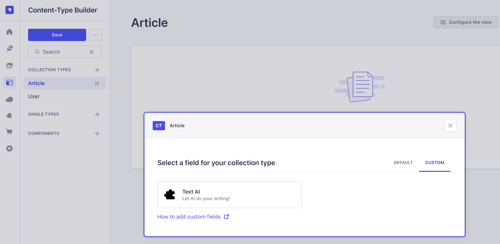
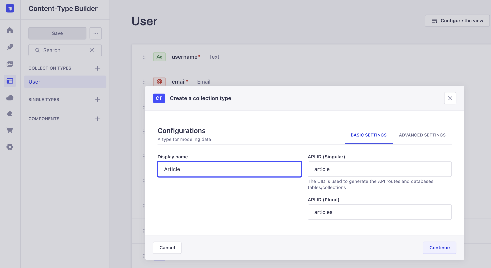
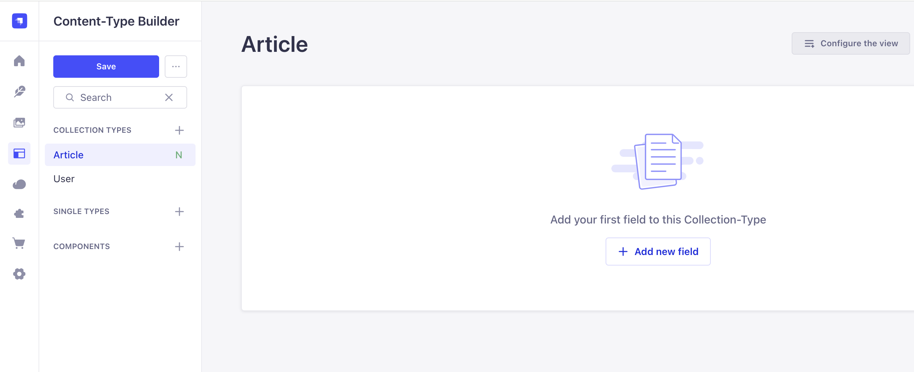
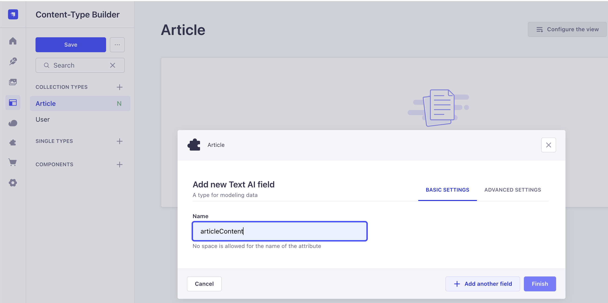
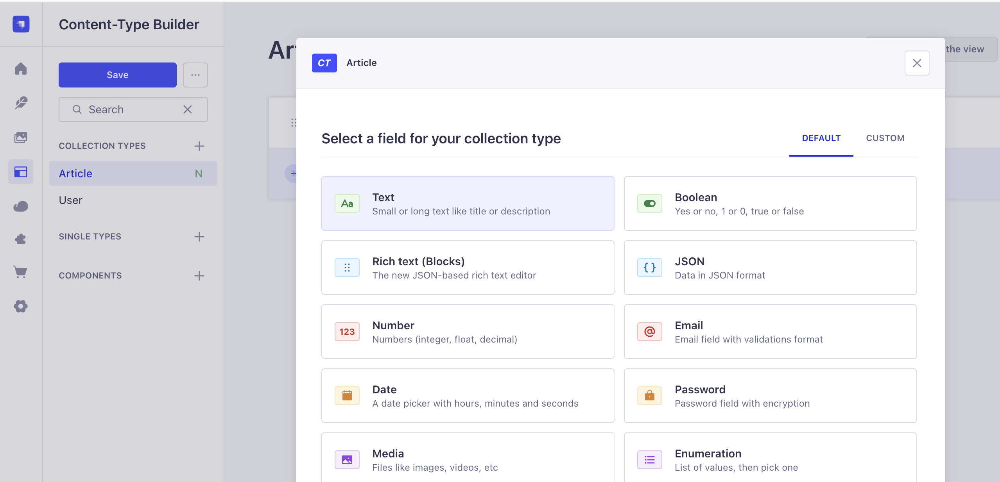
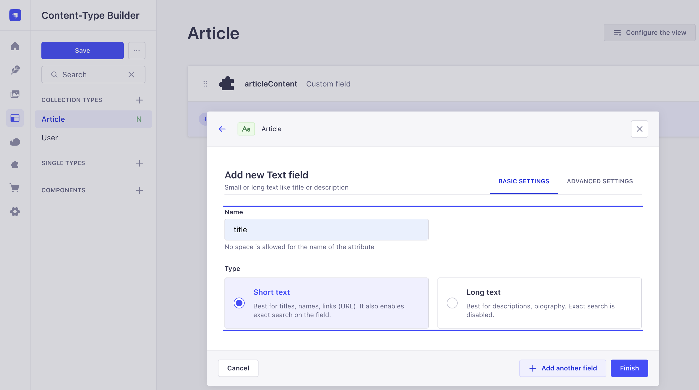
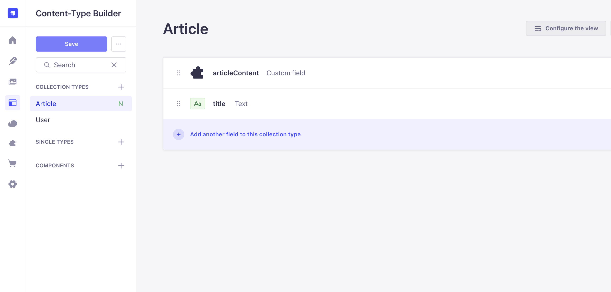
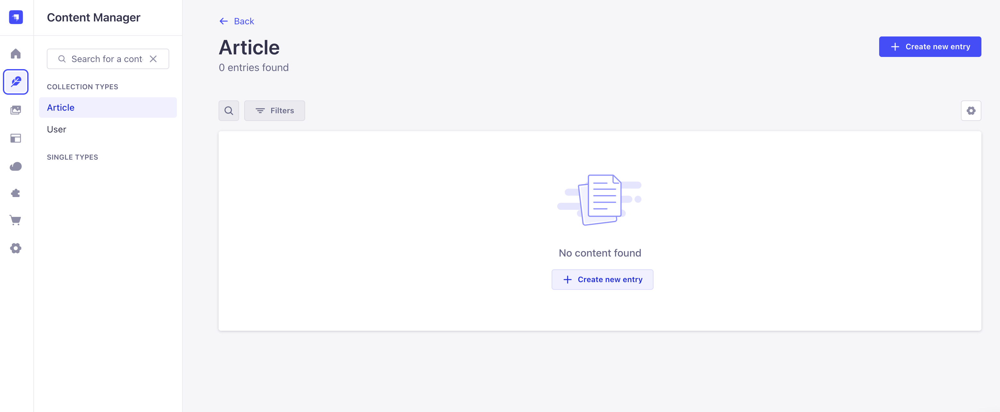
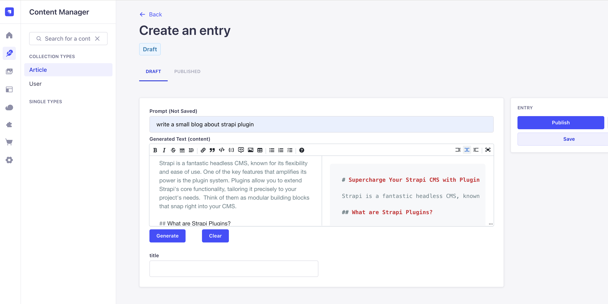

# Introduction

This repository provides an example Strapi project demonstrating how to install, configure, and use the `@genai/gemini-content-generator` plugin. The plugin leverages Google Gemini AI to automate and enhance content creation within Strapi. Use this example as a reference for integrating the plugin into your own Strapi applications.

---
# Using the plugin

## Installation

```bash
npm install @genai-cms/gemini-content-generator
```

## Enable Plugin
Add the plugin to your `config/plugins.js` or `config/plugins.ts`:

```js
module.exports = {
    'gemeni-content-generator': {
        enabled: true
    },
};
```

## Creating a Gemini API Key

1. Visit the [Google AI Studio](https://aistudio.google.com/app/apikey) and sign in with your Google account.
2. Click on "Create API key" and follow the prompts.
3. Copy the generated API key.
4. Add the API key to your `.env` file as shown below:
    ```
    GEMINI_API_KEY=<YOUR GEMENI API KEY>
    ```

## Usage

After the plugin installation and configuration, you can access the `Text AI` field under `CUSTOM` fields tab. You can use this field to generate content for your collection types using the Google Gemini AI service. Below screenshot shows the custom `Text AI`.



For more details, refer to the plugin documentation or the Strapi marketplace page.


# Using the Example Strapi Project
Follow below steps:
1. Navigate to the `example/strapi-genai-plugin-example` directory:
    ```bash
    cd example/strapi-genai-plugin-example
    ```
2. Install dependencies:
    ```bash
    npm install
    ```
3. Copy the `.env.example` file to `.env` and update the `GEMINI_API_KEY` with your Gemini API key:
    ```bash
    cp .env.example .env
    ```
4. Start the Strapi development server:
    ```bash
    npm run develop
    ```
5. Open your browser and go to [http://localhost:1337/admin](http://localhost:1337/admin) to access the Strapi admin panel and test the plugin.

6. use the sample user admin@demo.com and password: `StrapiDemo123`

## Sample Screen
### Create new collection type


### Add fields (custom and regular) to the collection





### Create new entry in the newly created collection

### Use the custom Text AI fields to generate content (using a prompt)


---

## Conclusion

The `@genai/gemini-content-generator` plugin brings the power of Google Gemini AI to Strapi, making content creation faster and smarter. With a robust architecture, clean admin UI, and automated publishing, it's ready for production use and open-source collaboration.


---

For more details, check the [README](./README.md) or open an issue on GitHub!


# 🚀 Getting started with Strapi

Strapi comes with a full featured [Command Line Interface](https://docs.strapi.io/dev-docs/cli) (CLI) which lets you scaffold and manage your project in seconds.


### `develop`

Start your Strapi application with autoReload enabled. [Learn more](https://docs.strapi.io/dev-docs/cli#strapi-develop)

```
npm run develop
# or
yarn develop
```

### `start`

Start your Strapi application with autoReload disabled. [Learn more](https://docs.strapi.io/dev-docs/cli#strapi-start)

```
npm run start
# or
yarn start
```

### `build`

Build your admin panel. [Learn more](https://docs.strapi.io/dev-docs/cli#strapi-build)

```
npm run build
# or
yarn build
```

## ⚙️ Deployment

Strapi gives you many possible deployment options for your project including [Strapi Cloud](https://cloud.strapi.io). Browse the [deployment section of the documentation](https://docs.strapi.io/dev-docs/deployment) to find the best solution for your use case.

```
yarn strapi deploy
```

## 📚 Learn more

- [Resource center](https://strapi.io/resource-center) - Strapi resource center.
- [Strapi documentation](https://docs.strapi.io) - Official Strapi documentation.
- [Strapi tutorials](https://strapi.io/tutorials) - List of tutorials made by the core team and the community.
- [Strapi blog](https://strapi.io/blog) - Official Strapi blog containing articles made by the Strapi team and the community.
- [Changelog](https://strapi.io/changelog) - Find out about the Strapi product updates, new features and general improvements.

Feel free to check out the [Strapi GitHub repository](https://github.com/strapi/strapi). Your feedback and contributions are welcome!

## ✨ Community

- [Discord](https://discord.strapi.io) - Come chat with the Strapi community including the core team.
- [Forum](https://forum.strapi.io/) - Place to discuss, ask questions and find answers, show your Strapi project and get feedback or just talk with other Community members.
- [Awesome Strapi](https://github.com/strapi/awesome-strapi) - A curated list of awesome things related to Strapi.

---

<sub>🤫 Psst! [Strapi is hiring](https://strapi.io/careers).</sub>
